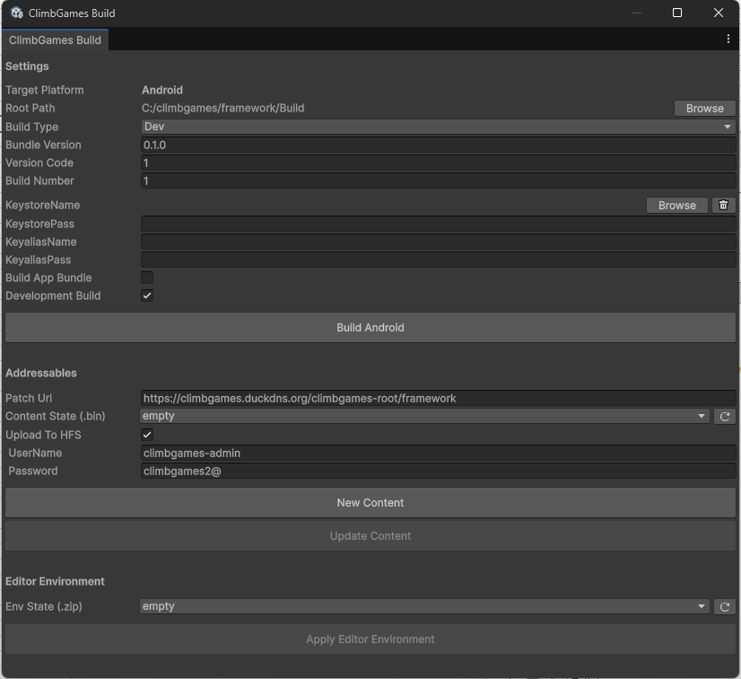
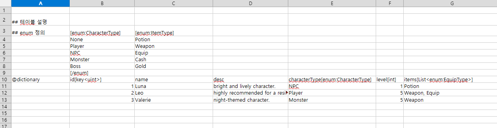
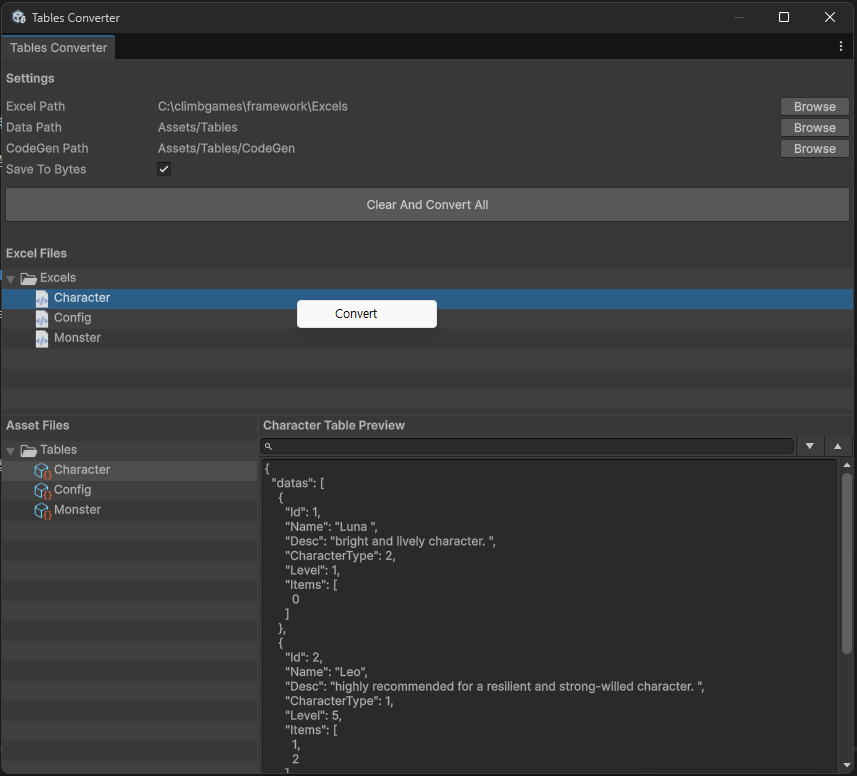

# ClimbGames Framework

ClimbGames Framework는 Unity 프로젝트에서 반복적으로 사용되는 **Core 시스템, Build Pipeline, Table 데이터 관리 기능**을 하나의 Framework로 제공합니다.

## Overview

* [**Core**](#1-core) — 게임 실행에 필요한 공통 시스템

  * Scene Transition
  * Singleton
  * FSM
  * UI Manager

* [**Build**](#2-build) — Unity Editor 및 Jenkins 기반 빌드/배포 시스템

  * Editor Build Tool
  * Addressables Build
  * Jenkins Shared Library
  * Jenkins Custom Scripts

* [**Table**](#3-table) — Excel 기반 게임 데이터 관리 및 코드 생성 시스템

  * Excel → C# Table 변환
  * Table Code Generation
  * Enum 자동 생성
  * Table 통합 접근
  * Binary 데이터 저장
  * Table Preview

---

# 1. Core

게임에서 공통적으로 사용되는 기본 시스템을 제공합니다.

## Scene Transition

`UniTask` 기반의 비동기 씬 전환 시스템으로, 씬 전환 과정에서 발생하는 **초기화, 활성화, 비활성화 및 Transition 연출**을 일관된 흐름으로 관리합니다.

### 주요 기능

* **비동기 씬 생명주기 관리**

  * `Deactivate`
  * `InitializeAsync`
  * `ActivateAsync`

* **Empty Scene 지원**

  * 씬 전환 과정에서 중간 `EmptyScene`을 거쳐 기존 씬의 리소스를 안정적으로 해제
  * `FrameworkSettings`를 통해 사용 여부 설정

* **Custom Transition 지원**

  * `ITransitionHandler`를 통해 씬 전환 전/후 연출을 자유롭게 구현
  * Fade, Loading UI, Progress Bar 등의 연출에 활용 가능

* **이벤트 기반 연동**

  * `transitionStarted`
  * `sceneLoaded`
  * 등의 이벤트를 통해 UI 및 기타 시스템과 연동

---

## Singleton

Unity의 `MonoBehaviour`를 기반으로 한 Singleton 시스템입니다.

`SingletonConfig`를 이용하여 Singleton 생성 방식과 `DontDestroyOnLoad` 여부를 설정할 수 있습니다.

### 사용 예시

```csharp
[SingletonConfig("Resources/UIManager", DontDestroy = true)]
public class UIManager : MonoSingleton<UIManager>
{
}
```

설정된 Singleton은 `Instance` 접근 시 필요한 경우 `Resources`의 Prefab을 자동으로 생성하고 `DontDestroyOnLoad`를 적용합니다.

---

## FSM

Enum 또는 Custom Type을 Key로 사용할 수 있는 **제네릭 기반 Finite State Machine**입니다.

상태 등록, 상태 전환 및 상태별 데이터 전달을 지원하며, 게임플레이 로직을 명확한 상태 단위로 분리할 수 있습니다.

### 사용 예시

```csharp
var fsm = new FSM<PlayerState>("PlayerFSM", showDebug: true);

fsm.Initialize(
    (PlayerState.Idle, new IdleState()),
    (PlayerState.Casting, new CastingState())
);

fsm.Start(PlayerState.Idle);

fsm.ChangeState(
    PlayerState.Casting,
    new CastingParam { Force = 10f }
);
```

---

## UI Manager

게임 내 UI의 생성, 표시, 숨김 및 레이어 관리를 담당하는 UI 관리 시스템입니다.

### 주요 기능

* **Camera Stacking 자동 구성**

  * `MainCamera`
  * `WorldUICamera`
  * `UICamera`
    를 기반으로 UI Camera Stack을 자동 구성
  * 씬 전환 시 Camera Stack을 동적으로 재구성

* **UILayer 기반 UI 관리**

  UI를 다음과 같은 계층으로 관리합니다.

  ```text
  Layer
   └─ World
   └─ UI
      └─ HUD
      └─ View
      └─ Popup
      └─ Top
      └─ System
      └─ Transition
  ```

* **비동기 UI 생성**

  * `AssetManager`와 연동하여 UI Prefab을 비동기로 로드
  * `ShowUI<T>`를 통한 UI 생성 및 표시

* **EventSystem 자동 구성**

  * 씬에 EventSystem이 없는 경우 필요한 EventSystem을 자동 생성
  * `InputSystemUIInputModule`을 사용하여 Unity Input System 기반 UI 입력 지원

### 사용 예시

```csharp
var viewData = new InventoryUIData();

var inventoryView =
    await UIManager.Instance.ShowUI<InventoryView>(
        "UI/InventoryView",
        UILayer.View,
        viewData
    );

UIManager.Instance.Hide(inventoryView);
```

---

# 2. Build

Unity Editor에서 직접 빌드하거나 Jenkins를 이용한 **원격 빌드 및 배포 환경**을 구성할 수 있습니다.

## Editor Build Tool



**메뉴 위치**

`Tools` > `ClimbGames` > `Build Window`

### 주요 기능

* Unity Application Build
* Addressables 기본 Build
* Addressables Content Update Build
* `addressables_content_state.bin` 기반 Content Update 지원
* Addressables Build 결과물 백업
* `EditorEnv.zip` 생성 및 테스트 지원

---

## Jenkins Shared Library

**경로**

```text
ClimbGames Framework/
└─ Editor/
   └─ Build/
      └─ Jenkins/
         └─ SharedLibrary/
```

Jenkins Pipeline에서 공통으로 사용할 수 있는 **OOP 기반 Build / Deploy Framework**를 제공합니다.

### 주요 구성

* `PipelineConfig`
* `DefaultSettings`
* `DefaultProcess`

프로젝트마다 반복되는 빌드 및 배포 로직을 공통화하고, 프로젝트별 설정과 프로세스를 확장할 수 있도록 구성되어 있습니다.

---

## Jenkins Custom Scripts

**경로**

```text
ClimbGames Framework/
└─ Editor/
   └─ Build/
      └─ Jenkins/
         └─ Scripts/
```

프로젝트별 Jenkins Pipeline을 구현하기 위한 Custom Script 영역입니다.

Framework에서 제공하는 기본 Build 기능을 기반으로 프로젝트의 환경에 맞는 **빌드, 배포 및 후처리 작업을 확장**할 수 있습니다.

---

# 3. Table

Excel로 관리하는 게임 데이터를 Unity에서 사용할 수 있는 **C# Table 및 ScriptableObject 기반 데이터로 자동 변환**하는 시스템입니다.

Excel Schema를 기반으로 C# 코드를 자동 생성하기 때문에 별도의 Table 클래스를 직접 작성하지 않고 데이터를 관리할 수 있습니다.




## 주요 기능

### Excel → C# Table 변환

Excel 데이터를 Unity에서 사용할 수 있는 C# Table 데이터로 변환합니다.

다음과 같은 Collection 타입을 지원합니다.

```text
@list
@dictionary
@keyvalue
```

선언된 타입에 따라 적절한 Table 구조를 자동으로 생성합니다.

TableHeader Column 정의

```
fieldName // excel 서식에 따라 타입이 정해짐
fieldName[int]  // 구체적인 타입 정의
fieldName[enum:ItemType] // enum 타입 정의
fieldName[List<int>] // 리스트 정의
fieldName[key<int>] // dictionary 타입의 key column 으로 사용
```

---

### C# Code Generation

Excel Schema를 기반으로 Table 관련 C# 코드를 자동 생성합니다.

예를 들어 다음과 같은 공통 코드가 자동으로 생성됩니다.

```text
TableEnum.cs
Tables.cs
```

* **`TableEnum.cs`**

  * Table에서 사용하는 Enum을 자동 생성

* **`Tables.cs`**

  * 프로젝트의 모든 Table에 접근할 수 있는 통합 진입점 제공

---

### Binary Data 지원

Table 데이터를 Binary 형태로 저장하고 로드할 수 있습니다.

이를 통해 프로젝트 환경에 따라 ScriptableObject 기반 데이터와 Binary 기반 데이터를 선택하여 사용할 수 있습니다.

---

### Table Preview

Unity Editor에서 변환된 Table 데이터를 직접 확인할 수 있는 **Table Preview 기능**을 제공합니다.

또한 전체 Table을 다시 변환하지 않고 **개별 Table 단위로 Conversion**할 수 있습니다.

---

## 사용 방법

### Asset 기반 Table Load

Unity Asset으로 생성된 Table 데이터를 로드합니다.

```csharp
await Tables.LoadAsync("tables");
```

### Binary 기반 Table Load

Binary 데이터가 포함된 `TextAsset`을 이용하여 Table을 로드할 수 있습니다.

```csharp
await Tables.LoadAsync<TextAsset>("tables");
```

---

## Table Workflow

전체적인 Table 데이터 작업 흐름은 다음과 같습니다.

```text
Excel
  │
  ▼
Table Converter
  │
  ├─ Delete UnusedFiles
  |
  ├─ C# Code Generation
  │    ├─ TableEnum.cs
  │    └─ Tables.cs
  │
  ├─ Table Asset
  │
  └─ Binary Data
        │
        ▼
     Tables.LoadAsync()
```

Excel 데이터를 수정한 후 Table Converter를 실행하면 **불필요 파일삭제 → 필요한 C# 코드 생성 → Table Asset 생성** 과정이 자동으로 수행됩니다.
